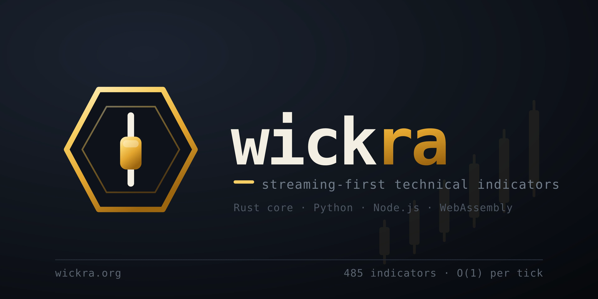
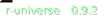

<p align="center">
  <a href="https://wickra.org"></a>
</p>

[](https://github.com/wickra-lib/wickra/actions/workflows/ci.yml)
[](https://github.com/wickra-lib/wickra/actions/workflows/codeql.yml)
[](https://codecov.io/gh/wickra-lib/wickra)
[](https://github.com/wickra-lib/wickra/releases/latest)
[](https://crates.io/crates/wickra)
[](https://pypi.org/project/wickra/)
[](https://www.npmjs.com/package/wickra)
[](https://www.nuget.org/packages/Wickra)
[](https://central.sonatype.com/artifact/org.wickra/wickra)
[](https://pkg.go.dev/github.com/wickra-lib/wickra-go)
[](https://wickra-lib.r-universe.dev)
[](https://github.com/wickra-lib/wickra#license)
[](https://scorecard.dev/viewer/?uri=github.com/wickra-lib/wickra)
[](https://www.bestpractices.dev/projects/13094)
[](https://github.com/wickra-lib/wickra/attestations)

**Streaming-first technical indicators.** Rust core with bindings for
Python, Node.js and WebAssembly, plus a C ABI any C-capable language links
against. Every indicator is a state machine
that updates in O(1) per new data point — same code for backtest and
live tick.

**Site:** [wickra.org](https://wickra.org) · **Docs:** [docs.wickra.org](https://docs.wickra.org)

```python
import wickra as ta

rsi = ta.RSI(14)
for price in live_feed:
    value = rsi.update(price)   # O(1) — no recomputation over history
    if value is not None and value > 70:
        print("overbought")
```

## Install

| Language | Install |
|---|---|
| Python | `pip install wickra` |
| Rust | `cargo add wickra` |
| Node.js | `npm install wickra` |
| Browser / WASM | `npm install wickra-wasm` |
| C / C++ (C ABI) | pre-built header + library from [releases](https://github.com/wickra-lib/wickra/releases) |
| C# / .NET | `dotnet add package Wickra` |
| Go (cgo) | `go get github.com/wickra-lib/wickra/bindings/go` |
| Java (FFM) | `org.wickra:wickra` on Maven Central |
| R (`.Call`) | `R CMD INSTALL bindings/r` (links the C ABI hub) |

No C compiler, no headers, no Rust toolchain required to install the native
packages — pre-built on every supported platform. The C ABI ships the same
way: a ready-to-link `wickra.h` + shared/static library per platform.

## Highlights

- **514 indicators** across twenty-four families (moving averages, momentum
  oscillators, trend & directional, price oscillators, volatility & bands,
  bands & channels, trailing stops, volume, price statistics, Ehlers / cycle
  DSP, pivots & S/R, DeMark, Ichimoku & charts, alt-chart bars, candlestick
  patterns, chart patterns, harmonic patterns, Fibonacci, microstructure,
  derivatives, market profile, market breadth, risk / performance, seasonality
  & session)
- **`batch == streaming` equivalence** — every indicator passes a
  bit-for-bit test that streaming results match batch results
- **Rust core forbids `unsafe`** — every binding inherits a memory-safe
  implementation
- **Verified against reference values** from TA-Lib and Wilder's
  original tables

## Repositories

- [**wickra**](https://github.com/wickra-lib/wickra) — main library (Rust core + Python / Node / WASM bindings + a C ABI for C / C++ / Go / C# / Java / R)
- [**wickra-docs**](https://github.com/wickra-lib/wickra-docs) — documentation site, live at [**docs.wickra.org**](https://docs.wickra.org): per-indicator deep-dives (formulas, parameters, warmup), quickstarts and migration guides
- [**webpage**](https://github.com/wickra-lib/webpage) — marketing site, live at [**wickra.org**](https://wickra.org): landing page, live in-browser WASM demo, benchmarks, and per-language API overviews

## License

Dual-licensed under [MIT](https://github.com/wickra-lib/wickra/blob/main/LICENSE-MIT) or [Apache-2.0](https://github.com/wickra-lib/wickra/blob/main/LICENSE-APACHE) — OSI-approved, permissive open source, free for any use including commercial.
